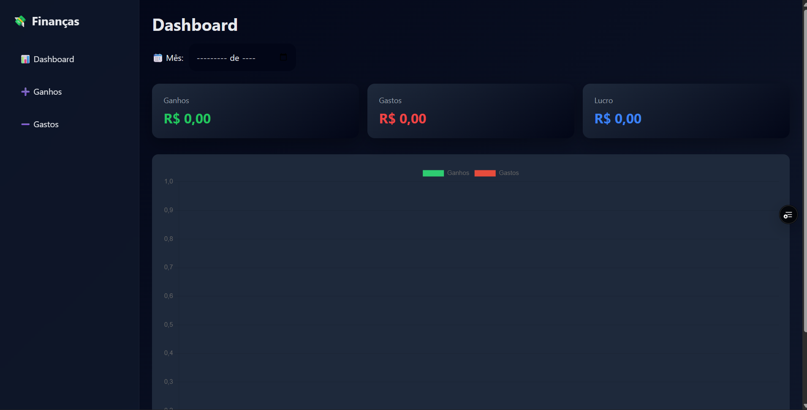
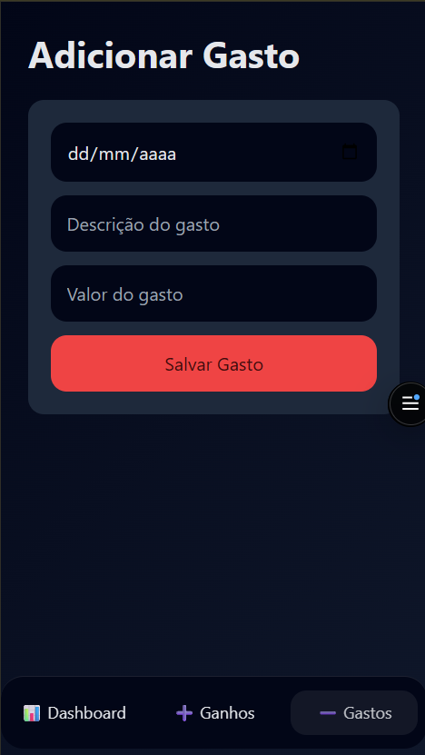

# 💰 FinanceApp — Controle Financeiro Web

Aplicação web para **controle de ganhos e gastos**, desenvolvida com foco em **simplicidade, organização visual e eficiência**.  
Ideal para pequenos negócios (como lanchonetes) ou para uso pessoal.

Projeto **publicado e funcional**, com dashboard moderno e dados persistidos no navegador.

---

## 🌐 Demo Online

🔗 Acesse a aplicação:  
👉 https://finance-app-vert-kappa.vercel.app/

---

## 🖼️ Prints do Sistema

### 📊 Dashboard Financeiro
Visão geral com resumo de ganhos, gastos, saldo atual e gráfico mensal.



---

### ➕ Cadastro de Ganhos
Tela dedicada para adicionar entradas financeiras de forma rápida e organizada.


---

### ➖ Cadastro de Gastos
Registro de despesas com categorias, valores e datas.



---

## 📌 Funcionalidades

- ✅ Cadastro de **ganhos (entradas)**
- ❌ Cadastro de **gastos (saídas)**
- 📊 **Dashboard financeiro**
- 📅 **Filtro por mês**
- 📈 **Gráfico mensal** de entradas x saídas
- 🧾 **Histórico diário**
- ✏️ **Editar registros**
- 🗑️ **Excluir registros**
- 💾 Persistência de dados com **LocalStorage**
- 📱 Interface **responsiva** (desktop e mobile)
- 🎨 Layout moderno com **cards organizados**

---

## 🎯 Objetivo do Projeto

O FinanceApp foi criado para resolver um problema simples que muita gente ignora:  
**organizar o dinheiro de forma clara e visual**.

Nada de planilhas confusas ou controles manuais.  
Aqui a ideia é: **registrou → visualizou → decidiu melhor**.

Tecnologia usada do jeito certo, sem exagero.

---

## 🛠️ Tecnologias Utilizadas

- **HTML5**
- **CSS3**
- **JavaScript (Vanilla JS)**
- **LocalStorage** (armazenamento local)
- **Chart.js** (gráficos)

> Projeto propositalmente sem frameworks pesados, focando performance e simplicidade.

---

## 📂 Estrutura do Projeto

```bash
📁 finance-app
 ├── index.html
 ├── style.css
 ├── script.js
 ├── assets/
 │   └── imagens, ícones, etc
 └── README.md
